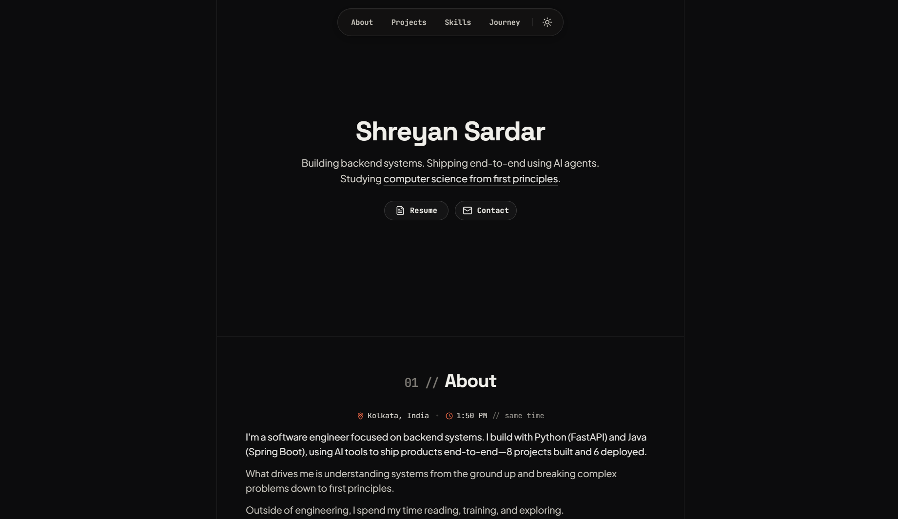

# Portfolio

> Personal developer portfolio and project showcase.

[](https://shreyansr.vercel.app)

---



---

## Features

- **Project Showcase:** Cards with architecture breakdowns, technical highlights, live demos, and repository links.
- **Milestone Timeline:** Interactive tracker for education, certifications, and milestones.
- **Skills Matrix:** Categorized display of core languages, backend frameworks, databases, and tooling.
- **In-App Document Viewer:** Embedded PDF viewer modal for resume and certifications.
- **Dynamic Theme & Local Time:** Light/dark mode toggle with live IST time display.

---

## Tech Stack

- **Frontend:** React 18, TypeScript, Vite, Tailwind CSS, Framer Motion
- **Hosting:** Vercel

---

## Getting Started

```bash
# Clone and install dependencies
git clone https://github.com/shreyansr01/portfolio.git
cd portfolio
npm install

# Start local dev server
npm run dev
```

---

## Author

**Shreyan Sardar** — [Portfolio](https://shreyansr.vercel.app) · [GitHub](https://github.com/shreyansr01) · [LinkedIn](https://www.linkedin.com/in/shreyansardar/)
